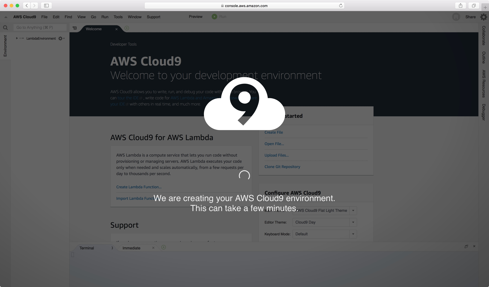
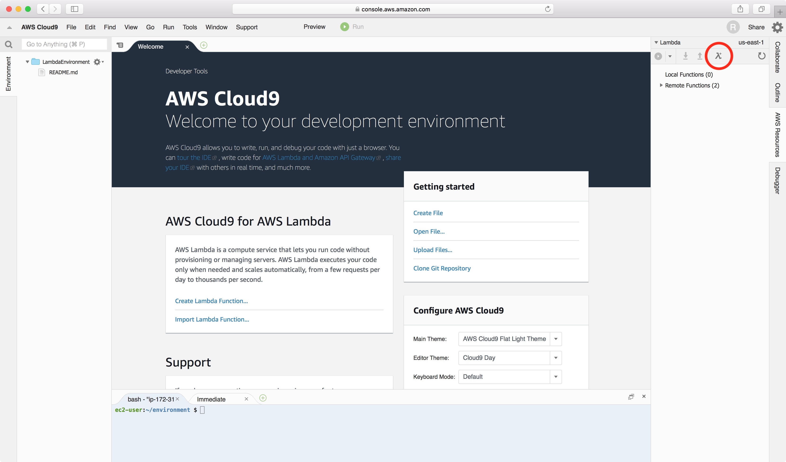
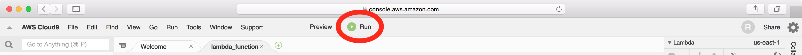
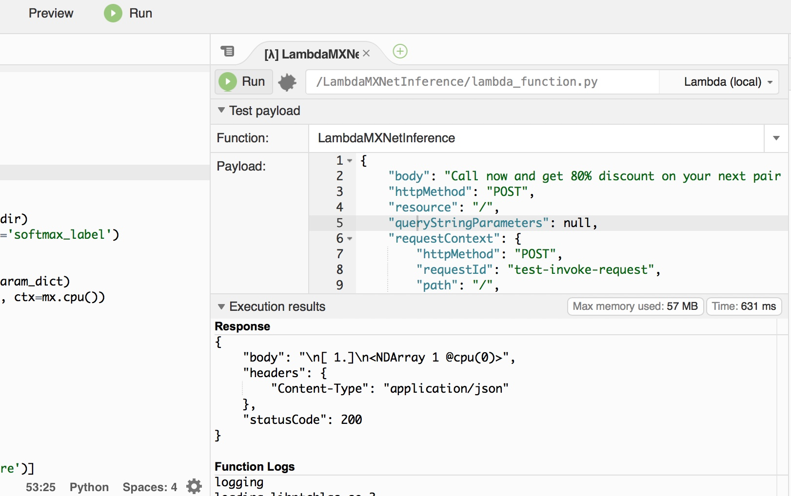
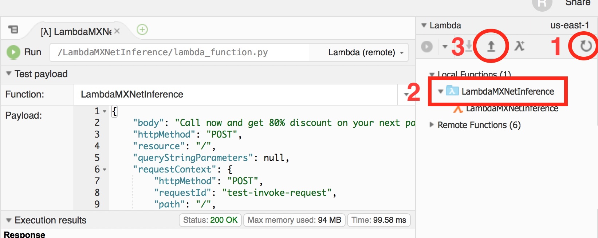
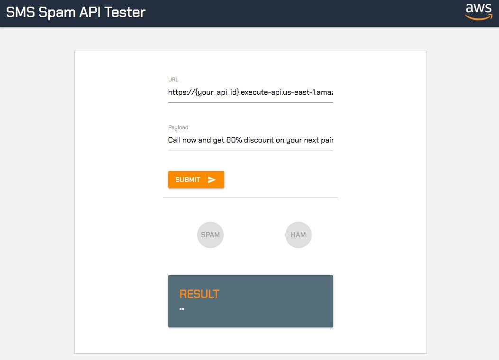

# Create Lambda function

Once you have trained your model and he's hosted in S3, the next thing to do is to create a Lambda function and expose it by Amazon API Gateway.

## Create Lambda function

In order to create the Lambda function, we will use Amazon Cloud9 that will help us to build the deployment package of the Lambda function and create the Lambda itself.

1. Open your **AWS Console** and open **Cloud9**
2. Click on **Create environment**
3. Add a name **smlambdaworkshop-env**, click on **Next step**
4. Leave the configuration with the default settings and click on **Next step**
5. Click **Create environment**

Now that we have created our Cloud9 environment we will be waiting a couple of minutes for the environment to be up and running and in front of us.



Once the environment is up and running please:

1. Press on AWS Resources on the right side of the screen
2. Click on the **Lambda icon** to create a new function as it is shown on the picture below  
3. Type a function name **smlambdaworkshopfunction** and click **Next**
4. Select **Python2.7** in runtime. Then chose **api-gateway-authorizer-python** and click **Next**
5. In Function trigger, leave none and click **Next**
6. In Create serverless application, leave as it is and click **Next**
7. Press **Finish**
8. Once clicked on **Finish** you might get a pop up window asking for **Drag & drop files here**, in this case, please ignore it by click on **x** on the top right corner of the popup window.

Now that we have created our Lambda function, we would need to remove the code from it.

Next, we need to add all the MXNet libraries, Lambda function code and the model into the folder of the Lambda. First, we will clone the git repository with the MXNet libraries.

Go to the command line in the bottom of the page ```ec2-user:~/environment $``` and from there paste the following command:

```
cd smlambdaworkshopfunction

git clone https://github.com/diegonat/smwshop.git
    
cd smwshop
    
rm -rf .git
    
mv * ../

cd ../

rm -rf smwshop

```

From git we will download all the necessary libraries in addition to the Lambda function code and the **template.yaml**. The template uses the **Serverless Application Model** to define how to deploy the Lambda function. Here the content:

```
AWSTemplateFormatVersion: '2010-09-09'
Transform: 'AWS::Serverless-2016-10-31'
Description: An AWS Serverless Specification template describing your function.
Resources:
  LambdaMXNetInference:
    Type: 'AWS::Serverless::Function'
    Properties:
      Handler: lambda_function.handler
      Runtime: python2.7
      Description: ''
      MemorySize: 256
      Timeout: 15
      CodeUri: .debug/
      Events:
        GetInference:
          Type: Api
          Properties:
            Path: /
            Method: any
        OptionsInference:
          Type: Api
          Properties:
            Path: /
	    Method: OPTIONS
```

In this template we define a Lambda function with Python 2.7 as runtime and we will also create the Amazon API Gateway that will expose the Lambda function with an ANY method.

Now we need to add the model that we trained. To do this, we will use AWS CLI to copy the file from S3. However, before we need to know the URL where the model is. In SageMaker before we indicated the S3 bucket were the model will be stored. By using S3 console we will look for the file and path.

1. Go to **AWS Console** and open **S3**
2. Select the S3 bucket with the name you chose before, in my case **lambdaMXnetBucket-dn**
3. Surf into the directory with the following format **smlambda-workshop-dn/sms-spam-classifier/output/sms-spam-classifier-mxnet-{YYYY-MM-DD-hh-mm-ss-sss}
4. remember this directory


Now we go back to Cloud9 and we copy in the Lambda function folder the model:

```
aws s3 cp s3://smlambda-workshop-{INITIALS}/sms-spam-classifier/output/sms-spam-classifier-mxnet-{YYYY-MM-DD-hh-mm-ss-sss}/output/model.tar.gz .

tar zxf model.tar.gz

rm model.tar.gz
```

We also remove the debug packages not needed:

```
rm -rf .debug/

```

Once you have downloaded and extracted the model, we can test the Lambda function locally. In order to do this:

1. Expand **smlambdaworkshopfunction** from the left panel
2. Double click on *lambda_function.py** file in order to open it
3. Once the file is open, click on the **Run button** on the top of the screen



2. This will open a new tab inside Cloud9 where we add the input for the Lambda. The input simulates a request coming from an Amazon API Gateway.



Here the code of the request and if you have a similar output, this means that your Lambda worked and that the message is considered as spam:

```
{
	"body": "FreeMsg: Txt: CALL to No: 86888 & claim your reward of 3 hours talk time to use from your phone now!",
	"httpMethod": "POST",
	"resource": "/",
	"queryStringParameters": null,
	"requestContext": {
		"httpMethod": "POST",
		"requestId": "test-invoke-request",
		"path": "/",
		"extendedRequestId": "test-invoke-extendedRequestId",
		"resourceId": "XXXXXXXXX",
		"apiId": "XXXXXXXX",
		"stage": "test-invoke-stage",
		"resourcePath": "/"
	},
	"accountId": "XXXXXXXXXXXX",
	"headers": null,
	"stageVariables": null,
	"path": "/",
	"pathParameters": null,
	"isBase64Encoded": false
}
```

Now that we tested the Lambda function locally, we are going to deploy it in AWS. Cloud9 by leveraging AWS SAM can deploy the lambda with a single click. 

From Cloud9, select the Lambda function **LambdaMXNetInference** and click refresh icon (1), next select the Lambda function (2) and at end click on the arrow (3):



Now, it would take a few minutes and the Lambda function will be deployed and the API Gateway is created.

Next step is to test the newly created API:

1. Open API Gateway console
2. Click on the new API. It will be created with a name similar to **cloud9-LambdaMXNetInference**
3. Select **Stages**
4. Select **Prod**
5. Copy the Invoke URL. It should have a format similar to **https://{some-random-keys}.execute-api.us-east-1.amazonaws.com/Prod**

Go to the URL [https://apitester.diegos.it/](https://apitester.diegos.it/) and add your Amazon API Gateway endpoint and press **SUBMIT**. It would be easy to see the result and the prediction. 


